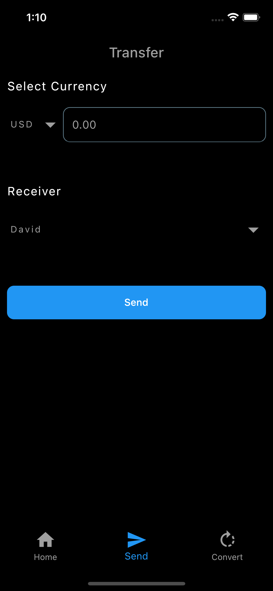

# FinTech (WIP)

This project uses transactions in Firebase(FirebaseAuth and FireStore) to send and receive virtual money across accounts.
On account creation, a user has $500 worth of money across 3 wallets, in different currencies(NGN,USD,GBP).
A user can make conversions from one currency to another currency across the three wallets depending on a user's wallet balance.

## Inspiration

Design inspiration by me 😎 

## Screenshots

| Home Screen | Transfer Screen | 
|    :---:     |     :---:      |  
|    |    |

| Conversion Screen | Transactions Screen | 
|    :---:     |     :---:      |  
|    |    |

## Features

⚡️ Registration and login (email and password)

⚡ Email verification

⚡ Three wallets with three different currencies(USD,GBP, NGN)

⚡ Conversion from one currency to another currency(wallet to wallet) 

⚡ Transfer and receive from any currency *WIP* 

## Contributions

🎉 Feel free to contribute to this project.

If you find a bug or want a feature and don't know how to fix, implement or go about it, please fill an [issue](https://github.com/GreatGodson/FinTech/issues) . 

If you fixed a bug or implemented a feature, please send a [pull request](https://github.com/GreatGodson/FinTech/pulls).

